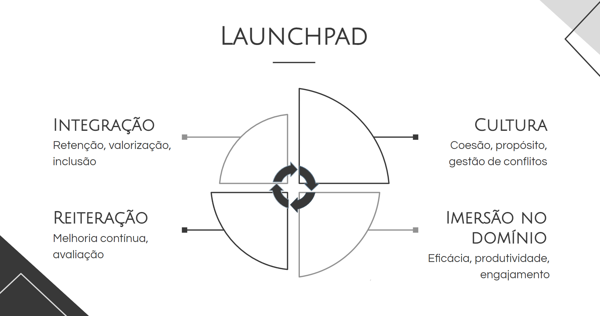

# Launchpad - Guia de Onboarding para Desenvolvedores

**Tabela de Conteúdos:**
- [Launchpad - Guia de Onboarding para Desenvolvedores](#launchpad---guia-de-onboarding-para-desenvolvedores)
  - [Introdução](#introdução)
  - [Capítulo 1: Compreendendo "Onboarding"](#capítulo-1-compreendendo-onboarding)
    - [Conceito](#conceito)
    - [Dimensões do Onboarding](#dimensões-do-onboarding)
      - [**Integração:**](#integração)
      - [**Cultura:**](#cultura)
      - [**Imersão no Domínio:**](#imersão-no-domínio)
      - [**Imersão na Tecnologia:**](#imersão-na-tecnologia)
      - [**Diagrama das Dimensões:**](#diagrama-das-dimensões)
  - [Capítulo 2: Estabelecendo o Alicerce](#capítulo-2-estabelecendo-o-alicerce)
    - [Fundamentação](#fundamentação)
    - [Mapa de Dependências](#mapa-de-dependências)
      - [**Compliance**](#compliance)
      - [**Acessos e procedimentos de requisição**](#acessos-e-procedimentos-de-requisição)
      - [**Referências para consulta sob demanda**](#referências-para-consulta-sob-demanda)
    - [Documentação Técnica](#documentação-técnica)
    - [Banco de tarefas](#banco-de-tarefas)
  - [Capítulo 3: Envolvimento dos Atores](#capítulo-3-envolvimento-dos-atores)
    - [Anfitrião de Integração](#anfitrião-de-integração)
    - [Mentor](#mentor)
    - [Parceiro](#parceiro)
    - [Gerenciamento de expectativa](#gerenciamento-de-expectativa)
  - [Capítulo 4: Execução](#capítulo-4-execução)
    - [**Integração**](#integração-1)
    - [**Imersão no domínio e tecnologia**](#imersão-no-domínio-e-tecnologia)
      - [Incunbências](#incunbências)
      - [Trabalhos paralelos](#trabalhos-paralelos)
    - [**Cultura**](#cultura-1)
  - [Capítulo 5: Iteração e Melhoria Contínua](#capítulo-5-iteração-e-melhoria-contínua)
    - [Avaliação e Feedback](#avaliação-e-feedback)
  - [Conclusão](#conclusão)
  - [Referências](#referências)

## Introdução

- O objetivo desta sessão será expor o propósito e motivação central do Guia.
- Reiterar sobre a introdução ao final, consolidando a visão geral obtida.

No mundo atual onde negócios estão cada vez mais digitalizados e falas como **“Toda empresa agora é uma empresa de software”** são cada vez mais aceitas, equipes de Desenvolvimento desempenham um papel vital e desafiador. Elas precisam - planejar, conceber, testar e disponibilizar novas formas de se resolver problemas reais através de Sistemas de Informação cada vez mais complexos. Essas equipes são pontes entre a visão e a realidade, esculpindo não somente o futuro da tecnologia que impulsiona nossa sociedade, como também criando e/ou modificando hábitos de pessoas.

Para Dave Farley, co-autor do livro Continuous Delivery, desenvolvimento de software é um processo inerentemente criativo que requer alto grau de colaboração. Equipes formadas por profissionais de diferentes áreas trabalham arduamente na criação de partes menores do todo que formam um sistema ou produto. Elas assim o fazem trocando e integrando continuamente informações; código; documentação e experiências.

Em cenários de substituição de pessoas, o qual é, infelizmente, comum ao contexto da criação e manutenção de software [[1]](#1)[[2]](#2)[[3]](#3), a perda de conhecimento e experiência de contribuidores antigos associada à necessidade de treinamento e inclusão de novos colaboradores, pode impactar significativamente o custo e a duração de um projeto. Segundo um estudo feito ainda em 1989 [[4]](#4), tais mudanças podem levar a acréscimos de 40% a até 60% no custo de desenvolvimento.

Como então se adaptar a esses desafios de forma a estabelecer um processo que auxilia a reter talento humano?

O **Launchpad** foi concebido como uma possível resposta para esse contexto. Sua hipótese principal e motivadora é que - **primeiras impressões importam**. Um funcionário acolhido por um processo de onboarding estruturado, onde é paulatinamente apresentado aos círculos sociais e modus operandi da sua empresa, sendo sujeito a etapas de treinamento com objetivos bem definidos e apoio, têm maiores chances de permanecer numa organização. Isso pois, desde o início, obteve as informações e suporte necessários para não somente exercer sua função como também assimilar os valores e objetivos estratégicos estabelecidos pela empresa.

## Capítulo 1: Compreendendo "Onboarding"

### Conceito
O processo de Onboarding, também conhecido como Socialização Organizacional, é o processo pelo qual novos colaboradores são integrados em uma organização, adquirindo conhecimento, habilidades, perspectivas culturais e integração com os círculos sociais necessários para o desempenho de suas funções de forma eficaz. A importância do Onboarding reside nos benefícios palpáveis que gera à empresas:

- Aceleração da curva de aprendizado, com redução do tempo para produtividade.
- Fortalecimento da cultura organizacional.
- Aumento do engajamento e comprometimento dos colaboradores com a empresa.
- Maior imersão e compreensão sobre o contexto, objetivos e proposta de valor da organização.
- Melhoria dos níveis de satisfação, com aumento do engajamento e comprometimento de novos funcionários com os objetivos estratégicos da empresa.

Porém, esses benefícios pressupõem não somente estabelecer uma base de conhecimento robusta com identificação prévia de metas relevantes ao contexto do time, como também a elaboração de uma estrutura de execução e reiteração que faça pleno uso desses recursos.

### Dimensões do Onboarding

Como forma de facilitar a visualização geral do processo, o **Launchpad** divide o Onboarding em dimensões:
- [Integração](#integração); 
- [Cultura](#cultura);
- [Imersão no Domínio](#imersão-no-domínio);
- [Imersão na Tecnologia](#imersão-na-tecnologia).

No que tange a duração, o define-se uma janela de tempo para o processo de Onboarding com unidades de tempo em semanas. Sugere-se um período entre 4 e 12 semanas, a ser modificado de acordo com as características e objetivos do time. Por exemplo - para uma equipe responsável pela manutenção e melhoria de um serviço de gerenciamento de tarefas, na qual o escopo de trabalho é bem definido e interno à empresa, um plano de 4 semanas pode ser uma boa opção. Já para outra equipe que lida com uma plataforma de e-commerce complexa e de grande escala, um plano de Onboarding mais extenso, de 12 semanas, pode ser mais aconselhável devido à maior complexidade técnica no que tange à escalabilidade, segurança e interação com clientes externos.

#### **Integração:**

Pode ser entendida como o conjunto de passos que visam promover a rápida e eficaz inserção dos novos colaboradores na organização. Este processo vai além da simples ambientação física, envolvendo também a socialização do indivíduo na cultura organizacional, compartilhamento de informações essenciais sobre a empresa, suas práticas e valores, bem como estabelecimento de vínculos interpessoais. Através da integração, os novos membros obtêm o suporte necessário para se adaptarem ao novo ambiente de trabalho, compreenderem suas funções e responsabilidades.

Como exemplos de passos relacionados à integração, cita-se:

1. **Sessões de Boas Vindas:** Momentos focados em introduzir novos colaboradores ao contexto do time, seus valores e objetivos. Visa fornecer informações claras sobre as responsabilidades e expectativas acerca da atuação desses indivíduos. Tais sessões tendem a ter uma estrutura fixa e pré-elaborada.
2. **Acolhimento Personalizado:** Alguns times optam por receber novos membros com uma abordagem personalizada, seja ao perfil daqueles que estão chegando ou dos comportamentos que o time deseja promover nessas pessoas. Nesses casos, não se segue uma estrutura pré-definida. 
3. **Atividades de "Team Building":** Atos de socialização entre os membros da equipe, como almoços em grupo, jogos colaborativos ou outras atividades que estimulem o relacionamento interpessoal e o espírito de equipe.

No que tange a escopo e tempo, entre as dimensões do Onboarding propostas, Integração é a única que deve ter uma janela de tempo de execução mais estrita. Seu foco é proporcionar uma ótima primeira impressão, uma introdução do novo membro à equipe e seu escopo de trabalho.

#### **Cultura:**

Cultura no contexto do Onboarding envolve a transmissão e execução de valores essenciais obtidos a partir da experiência conjunta de um grupo [[5]](#5). Através de uma história compartilhada e de um padrão consistente de liderança, tais valores foram validados como eficazes para o alcance dos objetivos de uma equipe. Uma cultura forte pressupõe a ampla prática e adesão desses valores como forma de gerar coesão e engajamento [[6]](#6).

Como exemplo, suponha uma equipe de desenvolvimento de software focada num sistema bancário de transações. Nesse caso, é de extrema importância que se garanta a estabilidade e confiabilidade do sistema já que este: 
- lida com a integridade dos dados financeiros de seus clientes; 
- assegura a continuidade de operações bancárias sem interrupções ou falhas. 

Ao longo do tempo, ao promover a qualidade do código a equipe percebeu uma redução de bugs, assim como maior estabilidade do sistema. Através de práticas como revisões de código regulares e testes automatizados, atos estes ativamente encorajados pela liderança do time, o apreço pela qualidade se tornou um valor essencial da equipe.

Uma cultura bem estabelecida torna explícito ao novo funcionário a identidade do grupo - o conjunto de crenças e visão de futuro que desejam promover. Através da assimilação dessa identidade, novos colaboradores são capazes melhor se alinhar com as expectativas organizacionais, demonstrando maior satisfação no trabalho, engajamento, comprometimento e senso de pertencimento. Dessa forma, a cultura se torna uma ferramenta poderosa na formação de uma equipe coesa e no estabelecimento e adesão de uma identidade compartilhada.

Quanto à tempo e escopo, Cultura é uma dimensão que deve ser exercida continuamente durante todo o processo de Onboarding. Ela não é apenas um conjunto de atividades a serem executadas. Ela é uma dimensão ampla pois envolvem valores - sua identificação, exercício e manutenção.

#### **Imersão no Domínio:**

<!--
Ler https://engsoftmoderna.info/cap2.html
-->

"Domínio de uma aplicação" pode ser entendido como o conjunto de regras de negócio, problemas, processos e conceitos que uma aplicação é projetada para suportar ou solucionar. Já "imersão no domínio" é uma etapa do processo de Onboarding que visa promover em novos colaboradores a compreensão do negócio, de seus objetivos e contexto operacional. Isso através de, principalmente, a realização de demandas reais. Tal entendimento paralelo à prática é essencial para que os desenvolvedores possam:
- Criar soluções que não somente funcionem tecnicamente, mas que também agreguem valor real ao negócio.
- Ter um tempo para produtividade menor e, dessa forma, contribuir mais cedo para os propósitos do time.
- Enxergar com mais facilidade o propósito de seu trabalho e como ele contribui para o sucesso da organização, auxiliando, assim, em gerar motivação e engajamento.

A título de exemplo, possíveis atividades a serem consideradas nessa dimensão seriam:

1. **Mentoria:** Designar um mentor experiente para novos funcionários. Essa pessoa, através de um acompanhamento individualizado, terá a função de guiar, esclarecer dúvidas e compartilhar conhecimento.
2. **Treinamento e Capacitação:** Execução de treinamentos e/ou atividades focadas em capacitar o novo colaborador nas tecnologias e especificidades técnicas do time. Exemplos incluem: Workshops em ferramentas e frameworks relevantes; Sessões de hands-on simulando a resolução de demandas do projeto; Pair programming.
3. **Execução de demandas:** Atribuir tarefas, com aumento gradual de complexidade, de forma a promover a participação de novos talentos na execução de melhorias e/ou manutenção do sistema em que o time atua.

No que tange a sua relação com outras dimensões do Onboarding, "Imersão no Domínio" deve andar paralelamente à "Imersão na Tecnologia". Ambas serão o foco principal do processo após a fase inicial de Integração.

#### **Imersão na Tecnologia:**

Enquanto a dimensão anterior foca no negócio e nos impactos que a aplicação sob responsabilidade do time tem na organização e stakeholders, a "Imersão na Tecnologia" lida com os artefatos e padrões técnicos utilizados pela aplicação. Em outras palavras, enquanto a "Imersão no Domínio" está focada nos requisitos funcionais e impactos gerados pela aplicação, a "Imersão na Tecnologia" tem como meta gerar compreensão dos requisitos não funcionais, ou seja, dos critérios que especificam como o sistema deve operar para atingir seus objetivos. De forma a ilustrar os possíveis tópicos a serem considerados nessa dimensão do Onboarding tem-se:

- Qual o paradigma de programação utilizado na aplicação? Por qual motivo ele foi escolhido? O que de positivo ele traz?
- No que tange à padrões arquiteturais, qual a forma de estruturação segue a aplicação e quais os trade-offs associados à essa escolha?
- Quais práticas são utilizadas no que tange à testes e critérios de qualidade de código? Quais os tipos de testes praticados, assim como ferramentas e frameworks de suporte? Quais as melhores práticas a serem seguidas para garantir qualidade e segurança para a aplicação?
- Qual o processo utilizado para o Gerenciamento de Configuração de Software (SCM)? Quais os fluxos de trabalho comuns ao projeto?
- Como funciona o processo de revisão de código? Quais os critérios de qualidade e padronização de código seguidos?
- Quais as práticas de DevOps seguidas no projeto? Quais as ferramentas e processos envolvidos nesse contexto?

#### **Diagrama das Dimensões:**

## Capítulo 2: Estabelecendo o Alicerce

O **Launchpad** foi desenvolvido a partir da crença de que a documentação é um alicerce para o Onboarding. Quanto mais ampla a gama de processos, valores, requerimentos, padrões arquiteturais e funcionalidades chave documentadas, mais robusto e menos dispendioso será a Socialização Organizacional. 

- Robusto pois a documentação torna tangível e consultável acordos tácitos e decisões relevantes ao contexto de atuação de um time, facilitando não somente o acompanhamento de seu progresso ao longo do tempo como também o entendimento do domínio e cultura da equipe. 

- Menos dispendioso pois, independente do contexto, times de desenvolvimento de software lidam com a geração e manutenção de conhecimento. Conhecimento pode ser transitório, seja porque não é mais aplicável ao contexto devido à mudanças do próprio negócio ou por forças externas (ex: mudanças de normas e leis), seja pela rotatividade de funcionários comum ao cenário de implementação e manutenção de software. Além disso, transmiti-lo é um ato que requer tempo e dedicação. Uma documentação organizada para consulta sobre demanda facilita o gerenciamento de conhecimento. Ela reduz os impactos negativos da saída de funcionários ao tornar consultável partes de seu saber. Ela facilita a transmissão de conhecimento de forma assíncrona, diminuindo assim a necessidade de acompanhamento direto de novos funcionários por parte de membros ativos no time, os quais, muitas das vezes, precisam conciliar múltiplas responsabilidades dentro do tempo limitado que possuem para a realização de suas atividades diárias.

Dito isso, bases de conhecimento para times de desenvolvimento são geralmente extensas e de difícil manutenção. Dessa forma, é importante que a experiência prática do Onboarding seja apenas uma parte do todo, idealmente apresentando aos novos talentos uma parte específica na qual terão maiores chances de trabalhar nas etapas iniciais de sua atuação. Acredita-se que uma experiência introdutória focada leva aos seguintes efeitos desejados como resultados do Onboarding - satisfação; engajamento e diminuição do tempo para produtividade.

As sessões deste capítulo - [Fundamentação](#fundamentação); [Mapa de Dependências](#mapa-de-dependências); [Documentação Técnica](#documentação-técnica); [Banco de Tarefas](#banco-de-tarefas) - definem a estrutura do **Alicerce:** o documento base para o processo de Socialização Organizacional proposto pelo **Launchpad**. Sua meta é não somente explicitar e facilitar a tarefa de identificação do contexto, objetivos, aspectos sócio comportamentais e processos internos relevantes à novos membros da equipe, como também prover os insumos necessários à realização de um processo de Onboarding de sucesso.

### Fundamentação

É importante que se entenda o cenário no qual uma equipe atua antes de se iniciar a execução do processo de Onboarding, já que é este meio que delimita o que é relevante para o sucesso do time e, consequentemente, a tomada de decisões e delimitação de metas para a Socialização Organizacional. As necessidades de um time focado no design de interfaces web interativas são diferentes das de um time focado na análise de dados. Enquanto o primeiro tem como prioridades a criação de layouts responsivos e a otimização da experiência do usuário, o segundo tem como foco a transformação de dados brutos em informações e visualizações relevantes à tomada de decisões de negócio.

Dessa forma, é crucial que se torne explícito, além de documentado, a conjuntura na qual um time está inserido. Para auxiliar nesse processo, propõe-se como exercício inicial de delimitação de escopo e exploração de contexto a resposta do seguinte modelo de perguntas, mesmo que de forma parcial:

1. Como um time de desenvolvimento de software, nossa área de foco é "...". Atuamos na "..." .
2. Nesse contexto, temos como objetivos "..." .
3. Esses objetivos agregam valor ao negócio pois "...", o que está alinhado com os seguintes objetivos estratégicos da organização "... " .
4. Nos esforçamos para alcançá-los levando em consideração os valores-chave da empresa "..." .
5. Como um time, nossas crenças fundamentais são que "..." .

A seguir expõe-se um exemplo de resposta baseado nesse modelo:

1. Como um time de desenvolvimento de software, nossa área de foco é **Front-end**. Atuamos na **criação e manutenção de interfaces web focadas em e-commerce, baseado no design system desenvolvido pela empresa**. 
2. Nesse contexto, temos como objetivos **aprimorar a usabilidade, acessibilidade e experiência de utilização desses sistemas, garantindo consistência visual e funcional com os padrões de design estabelecidos**.
3. Esses objetivos agregam valor ao negócio pois **contribuem para aumentar o engajamento dos usuários, melhorar as taxas de conversão e fortalecer a identidade das nossas marcas online**. Isso está alinhado com os seguintes objetivos estratégicos da organização **- aumentar sua presença em mídias digitais e potencializar vendas online**. 
4. Nos esforçamos para alcançar esses objetivos levando em consideração os valores-chave da empresa: **foco no cliente, excelência e inovação**. 
5. Como um time, nossas crenças fundamentais são que **a colaboração e a comunicação eficaz são essenciais para o sucesso, e que o aprendizado contínuo junto à adaptabilidade são cruciais em um ambiente de constante evolução tecnológica**.

### Mapa de Dependências

O Mapa de Dependências tem como função detalhar as necessidades logísticas, legais, tecnológicas e de acesso que novos colaboradores devem atender para começar a contribuir. Ele está dividido nas sessões:

- [Compliance](#compliance)
- [Acessos necessários e procedimentos de requisição](#acessos-e-procedimentos-de-requisição)
- [Referências para consulta sob demanda](#referências-para-consulta-sob-demanda)

#### **Compliance**

Conjunto de materiais e recursos destinados a assegurar que novos colaboradores compreendam e sigam as políticas, regulamentações e normas da organização. Tais documentos podem tomar diversas formas, desde contratos formais a slides e organogramas. Vale ressaltar que nem todo time de desenvolvimento de software precisa, necessariamente, se preocupar em mapear os pontos levantados nesta sessão. Isso pois, em alguns casos, a organização da qual o time faz parte é a responsável pelo mapeamento, execução e monitoramento de critérios de compliance. Esse conjunto de documentos, considerando o contexto de desenvolvimento, tem como pontos a serem considerados:

- **Obrigações legais e contratuais**:
  - Código de conduta: 
    - Documento que destaca expectativas de comportamento, ética no trabalho assim como diretrizes para resolução de conflitos.
  - Políticas de segurança:
    - Instruções quanto à segurança da informação, incluindo práticas recomendadas para senhas, treinamentos periódicos em cibersegurança, melhores práticas no uso de dispositivos pessoais e do trabalho.
  - Política de dados e privacidade:
    - Registro das leis de segurança e privacidade dos dados a serem seguidas no exercício do trabalho de desenvolvimento. Se o escopo de trabalho do time envolve o Brasil e dados de cidadãos brasileiros, por exemplo, nesse caso a equipe precisa garantir que está seguindo a Lei Geral de Proteção de Dados Pessoais (LGPD ; L'13709).
- **Recursos necessários à produção**:
  - Hardware:
    - Documento, lista ou inventário delimitando os dispositivos físicos necessários ao exercício do trabalho, assim como suas respectivas especificidades técnicas. Itens a serem considerados incluem, mas não estão limitados a: Computador; Notebook; Monitores; Processadores; Dispositivo de Armazenamento e/ou Backup.
  - Software e licenças:
    - Lista os softwares necessários, incluindo ferramentas específicas para compliance e segurança, como antivírus, firewalls e sistemas de monitoramento. Dentre exemplos cita-se: Licenças de sistemas operacionais, ferramentas de desenvolvimento (IDEs, editores de texto), software de gestão de projetos (Jira, Trello), e ferramentas de colaboração (Slack, Microsoft Teams).
  - Suporte técnico e manutenção:
    - Delimitação dos contatos para a resolução de problemas técnicos e de manutenção de equipamentos. Essa esfera de documentos também pode incluir procedimentos e regras a serem seguidas no que tange à atualização de software e hardware (ex: frequência desejada; versões suportadas; etc).
  - Ergonomia:
    - Conjunto de regras e equipamentos necessários à garantia de conforto e saúde dos membros da equipe. Sua função é prevenir lesões ocupacionais. Isso inclui a escolha de cadeiras ergonômicas, mesas ajustáveis, suportes para monitores, teclados e mouses ergonômicos, iluminação e ventilação adequada, além da organização do espaço de trabalho para reduzir o esforço físico e mental dos colaboradores.

#### **Acessos e procedimentos de requisição**

Independente do porte de um time e natureza do sistema com que trabalham, sempre haverá uma suíte de ferramentas internas e externas utilizadas no exercício das funções da equipe. Dessa forma, faz-se necessário um catálogo dessas ferramentas, assim como do nível de permissão e formas apropriadas para requisição de acesso.

No que tange à permissões, esse item também pode ser entendido como os diferentes conjuntos de ações ou operações específicas que determinados papeis dentro de um sistema podem realizar. Considerando o momento de Onboarding onde funcionários estão aprendendo um novo cenário, pode ser mais seguro dar a essas pessoas um papel com nível de permissões limitada, no intuito de reduzir possíveis problemas (ex: deleção de dados; modificação indevida de configurações críticas; acesso não autorizado a informações sensíveis). Assim, num cenário ideal esse quesito deve estar de acordo com as designações de compliance levantadas no item anterior, sejam elas estipuladas pelo próprio time através de melhores práticas de segurança como o princípio do menor privilégio, obrigações contratuais para com o cliente ou políticas da organização na qual o time está inserido.

O catálogo dessas informações pode tomar diferentes formas:
- Planilhas
- Tabelas
- Diagramas

A nível de simplificação, sugere-se ao menos uma tabela com as seguintes colunas:
- Nome da Ferramenta
- Utilidade da Ferramenta
- Papel e Permissões
- Procedimento de Requisição
- Responsáveis pela Aprovação

Segue uma tabela de exemplo:

| Nome da Ferramenta | Utilidade da Ferramenta          | Papel e Permissões               | Procedimento de Requisição  | Responsáveis pela Aprovação |
| ------------------ | -------------------------------- | -------------------------------- | --------------------------- | --------------------------- |
| GitHub             | Plataforma de controle de versão | Desenvolvedor: Leitura e Escrita | Preenchimento de formulário | Pessoa X - email@email.com  |
| Jenkins            | Serviços de CI/CD                | Administrador: Projeto X         | E-mail para responsável     | Pessoa Y - email@email.com  |
| Jira               | Gerenciamento de Projetos        | Usuário: Leitura                 | Solicitação via portal TI   | Pessoa Z - email@email.com  |

#### **Referências para consulta sob demanda**

Parte importante do Alicerce proposto pelo **Launchpad** é a tomada de medidas para facilitar a navegação da base de conhecimentos do time por novos colaboradores. Reiterando, novos colaboradores devem ser apresentados a um filtro do todo, sendo esse idealmente alinhado com o que essas pessoas terão maiores chances de atuar nos momentos iniciais de sua carreira na equipe. Assim, sugere-se a criação e/ou separação dos seguintes artefatos num local único, de forma a facilitar sua consulta e atualização contínua:

- Processos
- Links relevantes no dia a dia
- Tabela de membros

A título de exemplo, pense em uma equipe internacional focada na criação e manutenção de um e-commerce web. Houve uma recente contratação de um desenvolvedor Front-end que irá substituir o atual membro do time. Dentre as possíveis referências a serem mapeadas, poderíamos considerar:

- Processos
  - SCM
  - Atualização de ambiente
  - Requisição de deployments
- Links relevantes no dia a dia
  - Ambientes (dev; produção)
  - Repositórios
  - Templates de design
- Tabela de membros:

| Nome            | Papel na Equipe                           | Contato                   | País/Localização   | Timezone |
| --------------- | ----------------------------------------- | ------------------------- | ------------------ | -------- |
| Maria Silva     | Desenvolvedora Backend                    | maria.silva@email.com     | Brasil             | GMT-3    |
| Julia Santos    | Desenvolvedora Front-end                   | julia.santos@email.com    | Brasil             | GMT-3    |
| João Souza      | Novo Colaborador - Desenvolvedor Front-end | joao.souza@email.com      | Portugal           | GMT+1    |
| Ana Pereira     | Analista de QA                            | ana.pereira@email.com     | EUA (Califórnia)   | GMT-7    |
| Carlos Lima     | Engenheiro DevOps                         | carlos.lima@email.com     | Índia              | GMT+5:30 |
| Luisa Fernandes | Designer UX/UI                            | luisa.fernandes@email.com | Austrália (Sydney) | GMT+10   |

### Documentação Técnica

Esta sessão do Alicerce tem como foco o desenvolvimento e/ou separação dos documentos técnicos relevantes ao contexto de uma pessoa sendo submetida ao processo de Onboarding. O grau de abrangência e granularidade dessa documentação depende principalmente de dois fatores: 
- Do contexto em que o time está inserido;
- Das partes específicas do todo que compõem uma aplicação ou projeto nas quais um recém-contratado terá mais chances de atuar nas fases iniciais de sua atuação.

A principal ferramenta que auxilia nesse processo de filtragem, de escolha do que deve compor a documentação técnica destinada a recém-integrados, é a [Fundamentação do Alicerce](#fundamentação). Fazendo alusão a exemplos expostos anteriormente, um time com aplicação voltada para a análise de dados poderia dar ênfase a itens de documentação como:

- Padrões de modelagem de dados, com uma descrição detalhada dos esquemas de banco de dados, tabelas principais e suas relações, incluindo exemplos de consultas comuns utilizadas.
- Pipelines de Dados: Explicação dos processos de ETL (Extração, Transformação e Carga), com diagramas de fluxo de dados e exemplos de scripts de transformação.
- Guias de uso para ferramentas relevantes ao processo de análise e formulação de informações a partir dos dados obtidos (bibliotecas, frameworks, etc), incluindo tutoriais e casos exemplo quando possível.

Já outro time focado na manutenção e extensão de um e-commerce poderia enfatizar itens como:

- Documentação sobre a arquitetura de microserviços, incluindo diagramas de interação entre eles.
- Exemplos de fluxos de chamadas de API relevantes à realização de tarefas como o processamento de pedidos e manipulação de inventário.
- Guias detalhados sobre como integrar e testar diferentes gateways de pagamento, com exemplos de configuração e código para a realização de transações seguras.

O **Launchpad**, como um guia, tem caráter propositivo. Dessa forma abaixo encontram-se alguns dos tópicos, comuns ao ofício de desenvolvimento e manutenção de software, que podem ser considerados na elaboração da documentação técnica que compõe o Alicerce.

- **Paradigma de programação:**
  - Programação Orientada a Objetos (POO)?
  - Programação Funcional?
  - Programação Procedural?
- **Padrões Arquiteturais:**
  - Microsserviços?
  - Event-driven-architecture?
  - Arquitetura de portas e adaptadores (hexagonal)?
- **Testes e Qualidade de Código:**
  - Tipos de testes praticados: 
    - Unitários, 
    - Integração, 
    - End-to-end, etc.
  - Ferramentas e frameworks.
  - Melhores práticas a serem reforçadas durante o processo de escrita e manutenção de testes.
  - Estabelecer a necessidade ou não de cobertura de testes, assim como o valor de cobertura do código almejada.
- **Gerenciamento de Configuração de Software (SCM):**
  - Sistema de controle de versão utilizado (Git; Subversion; Mercurial; etc).
  - Fluxos de trabalho (Workflows) comuns: Git Flow, GitHub Flow, GitLab Flow.
  - Práticas recomendadas para commits, branches, merges, resoluções de conflitos, etc.
- **Revisão de Código:**
  - Processos de code review: Pull Requests, Merge Requests.
  - Ferramenta de revisão de código.
  - Critérios de qualidade a serem considerados:
    - legibilidade, 
    - eficiência, 
    - segurança,
    - padrões de codificação.
- **Tipos de repositórios utilizado:**
  - Monorepo
  - Polirepo.
- **Práticas de DevOps:**
  - Integração Contínua (CI)
  - Entrega Contínua (CD)

<!--
Exemplo de itens a serem considerados na documentação técnica
- Lista de tecnologias utilizadas no Front-end:
  - Next.js
  - Typescript
  - Tailwind
- Features de domínio:
  - Otimizações de SEO
  - Busca e listagem de produtos
  - Carrinho de compras
- Integrações relevantes:
  - API's de busca e transações
-->

### Banco de tarefas

Artefato final do Alicerce, o banco de tarefas tem como objetivo prover os insumos necessários à imersão do recém-chegado no domínio em que o time atua, assim como nas tecnologias utilizadas no projeto. Sua elaboração é feita através da separação de encargos, idealmente pré-refinados, que foram identificados com um nível de complexidade condizente com o perfil de senioridade do novo colaborador. De forma a facilitar a atribuição futura dessas atividades, seu nível de complexidade deve ser expresso de alguma maneira. Por simplicidade, recomenda-se uma prática comum, com o uso da sequência de fibonnaci (1,2,3,5,8,...). Tarefas candidatas incluem, mas não estão limitadas a:

- **Resolução de débitos técnicos através da refatoração:**
  - Reduzir duplicidade de código : tratamento de código duplicado através da criação de métodos ou classes utilitárias que encapsulam a lógica repetida.
  - Modularização e simplificação de métodos : dividir funções longas em partes menores, idealmente especializadas na resolução de uma única parte do problema.
  - Redução de acoplamento : identificar e remover dependências desnecessárias entre classes e módulos utilizando, por exemplo, práticas como injeção de dependências ou até mesmo a substituição de instâncias diretas de classes por interfaces mais fáceis de serem substituídas sob demanda.
- **Revisão e melhoria da suíte de testes implementada:**
  - Em projetos que fazem uso de testes, esses são um valioso mapa dos requisitos de negócio e problemas técnicos que o domínio da aplicação procura solucionar. Dessa forma, trabalhar na manutenção e criação de testes tende a oferecer uma visão abrangente das funcionalidades do sistema, auxiliando novos colaboradores a compreender o contexto em que estão sendo inseridos.
- **Contribuições para a documentação do time:**
  - Fazer com que recém chegados sigam a documentação vigente e, caso necessário, proponham alterações, é uma ótima atividade a ser considerada. Ela não somente apresenta o novo membro aos processos disponíveis, como também auxilia na manutenção e melhoria da base de conhecimento do time.
  - Em um caso de estudo realizado em 2010 na Google [[7]](#7), por exemplo, foi constatado que novos engenheiros de software são encorajados a contribuir com entradas no glossário oficial da organização, cujo objetivo é auxiliar funcionários a entender jargões e contextos típicos da empresa, como também no “Manual do Desenvolvedor Google”, o qual contém explicações e links para recursos especializados, como guias de estilo.
- **Aprendizagem entre pares:**
  - "Codelabs" : tutoriais práticos, ministrados por membros já estabelecidos no time, nos quais o aluno segue instruções passo a passo para a resolução de uma determinada tarefa comum ao contexto de atuação do time, utilizando para tal as tecnologias empregadas no projeto.
  - "Pair Programming" : diferente de "Codelabs", o "Pair programming" não é uma atividade pré-estruturada. Ela consiste no trabalho conjunto entre o recém-chegado e um desenvolvedor mais experiente na resolução de demandas. Isso não só ajuda no aprendizado de melhores práticas e padrões de codificação do projeto, mas também facilita a transferência de conhecimento tácito, promovendo maior integração na equipe.
  - Revisões de código : a participação ativa nesse processo, tanto como autor quanto como revisor, auxilia na compreensão do código-base e cultura de codificação do time.

<!--
IMP: Explicite as diferentes formas que os sub-documentos do Alicerce podem tomar. Planilhas; Backlog; Tickets; Stickers; etc. Procure sempre dar uma visão de algo tangível para cada passo do **Launchpad**.
-->

## Capítulo 3: Envolvimento dos Atores

Neste capítulo tanto se identifica quanto se descreve as diferentes figuras envolvidas no processo de Socialização Organizacional de desenvolvedores, assim como suas respectivas responsabilidades e encargos coletivos para com pessoas sendo submetidas ao processo de Onboarding.

### Anfitrião de Integração

Sua função é garantir que o novo colaborador tenha uma recepção calorosa e informativa, promovendo uma primeira impressão positiva e facilitando a adaptação inicial. O escopo de suas ações deve ser tanto garantir quanto repassar a novos funcionários aquilo que precisam para iniciar seu trabalho no time.

**Responsabilidades:**

- Boas-Vindas: 
  - Realizar sessões de boas-vindas, seja 1:1 ou com demais membros da equipe, procurando repassar de forma resumida seu contexto, valores e objetivos.
- Orientação Inicial: 
  - Fornecer informações básicas sobre as políticas da empresa e/ou equipe, regras de segurança e procedimentos operacionais de acordo com os itens de [Compliance](#compliance) vigentes.
- Coordenação de Atividades: 
  - Organizar e coordenar atividades de integração, como dinâmicas em grupo e eventos de team building.
- Mediar Conflitos:
  - Atuar como mediador em potenciais conflitos que possam surgir durante o período de adaptação, ajudando a resolver desentendimentos e facilitando a comunicação entre o novo colaborador e a equipe.

### Mentor

Pessoa experiente do time que irá acompanhar pessoalmente o progresso do novo colaborador, seja durante períodos específicos ou todo o processo de Onboarding. Idealmente, deve ser uma figura exemplar no que tange tanto ao seu comprometimento com os valores essenciais da equipe quanto ao seu conhecimento do domínio e tecnologia aplicados no time. 

**Responsabilidades:**

- Orientação Técnica:
  - Auxiliar no entendimento das ferramentas e tecnologias utilizadas pela equipe.
- Acompanhamento Individualizado: 
  - Oferecer suporte contínuo ao novo colaborador, procurando entender assim como solucionar dificuldades enfrentadas por recém-chegados.
- Sugestão ou atribuição de [incunbências](#incunbências):
  - Como a pessoa que irá acompanhar de perto o progresso do novo integrante, o mentor estará mais apto a auxiliar na escolha de tarefas a serem repassadas a esses indivíduos.
- Feedback Regular: 
  - Fornecer feedback construtivo e orientar sobre o desempenho do novo colaborador.
- Facilitar a Integração do recém chegado nos círculos sociais da equipe: 
  - Ser a ponte entre o novo membro e a equipe, facilitando a construção de relações interpessoais.

### Parceiro

Membros do time que provêm suporte secundário à pessoas sendo submetidas ao processo de Onboarding. Podem ou não ter responsabilidades semelhantes à de mentores. São figuras de apoio, dando auxílio momentâneo em casos de indisponibilidade do Mentor.

**Responsabilidades:**

- Apoio de curto prazo: 
  - Fornecer suporte em períodos curtos e específicos, ajudando o novo colaborador a resolver dúvidas imediatas e problemas pontuais.
- Treinamento específico: 
  - Conduzir sessões de treinamento. Exemplo: workshops focados nas tecnologias e processos específicos do domínio em que o time atua.

### Gerenciamento de expectativa

Independente do papel exercido por membros do time que auxiliam no processo de Onboarding, é importante que tenham em mente o seguinte dever, partilhado entre todos envolvidos no processo - **Gerenciamento de expectativas**. Inicialmente, cabe ao Mentor, junto à liderança do time, definir expectativas realistas nos seguintes pontos:
- **Escopo do trabalho:**
  - Estabelecer que o nível de complexidade e impacto esperado irá aumentar de forma gradual e de acordo com a familiarização da pessoa com o sistema.
  - Clarificar quais partes do projeto o novo colaborador estará mais envolvido inicialmente, como módulos específicos ou tipos de problemas a serem resolvidos.
- **Desempenho:**
  - Velocidade de Aprendizado: Espera-se que novos colaboradores levem um tempo para entender o contexto, sistema e processos internos. O processo de aprendizado leva tempo e isso é normal e desejável.
  - Volume de Trabalho Inicial: Nos primeiros meses, o foco estará mais na aprendizagem e menos na entrega de grandes volumes de trabalho.
  - Qualidade vs. Quantidade: A qualidade do trabalho entregue é mais importante que a quantidade durante o período de Onboarding.
- **Comunicação:**
  - Qual etiqueta e/ou boas práticas de comunicação devem ser respeitadas.
  - Qual o nível de integração social desejado.
  - Quais reuniões e dinâmicas de equipe são vistas como importantes, assim como grau esperado de participação nesses momentos. 
- **Hierarquia:**
  - Estrutura hierárquica a ser respeitada (caso exista), assim como papel de cada figura envolvida.
  - Quando problemas devem ser escalados e quais as linhas de comunicação propícias nesses casos.
 
Após esse momento inicial, cabe aos atores envolvidos no processo de Onboarding transmitir essas informações no intuito de se reduzir o estresse comum ao contexto de incerteza e adequação ao novo em que recém-chegados se encontram. Estudos [[8]](#8)[[9]](#9) destacam que essa transparência é um fator relevante pare evitar equívocos comuns como os descritos abaixo:
- “Devo fazer tudo sozinho para que meu gerente tenha uma boa impressão de mim.”
- “Devo ser a pessoa que resolve qualquer bug/demanda que encontrar. Além disso, eu devo começar a resolvê-lo imediatamente, mesmo que não tenha tempo para isso.”

Transparência quanto à expectativas ameniza incertezas e estresse à medida que auxilia na compreensão do que se é esperados. Dentre as diferentes formas de repasse de expectativas a serem praticadas, tem-se:

- Discussões abertas em momentos propícios (reuniões "one on one").
- Revisões periódicas do progresso da pessoa sendo introduzida à organização.
- Documentação de planos de curto e longo prazo quanto a resultados estratégicos esperados do time.

Tais práticas geram transparência e comunicação clara de forma a estabelecer um ambiente propício à aprendizagem. O resultado é uma assimilação mais coesa, contribuindo, em última análise, para uma sensação de segurança psicológica e redução de incertezas.

## Capítulo 4: Execução

A execução da socialização organizacional proposta está separada em três momentos, os quais tem relação direta com as ["Dimensões do Onboarding"](#dimensões-do-onboarding) expostas no capítulo 1:
- [Integração](#integração-1)
- [Cultura](#cultura-1)
- [Imersão no domínio e tencologia](#imersão-no-domínio-e-tecnologia)

### **Integração**

- **Objetivos** - Retenção; valorização; acolhimento.
- **Principal ator** - [Anfitrião de integração](#anfitrião-de-integração).
- **Timing** - Executado no início do processo, com tempo de execução e passos definidos.

Fase inicial do processo de Onboarding proposto pelo **Launchpad**, a integração também é a mais direta uma vez que envolve objetivos bem definidos e padronizáveis. Nela o [anfitrião de integração](#anfitrião-de-integração) deve repassar ao novo colaborador tudo aquilo que foi definido como necessário para que essa pessoa comece a produzir e se ajustar ao time. O principal artefato do Alicerce que auxilia nessa identificação é o [Mapa de dependências](#mapa-de-dependências). Dentre as três fases propostas ela deve ser a mais curta, recomendando-se não mais que uma semana para sua realização.

O resultado almejado é que, ao final deste momento, o novo integrante tenha ciência:
- De quem são seus colegas de trabalho - nome; contato; horas de trabalho; área de especialidade; etc.
- Quem será seu mentor e quais são os parceiros que prestarão suporte durante o processo de Onboarding.
- De quais os ritos ou reuniões ela deve participar, assim como seus dias de execução e horários.
- De canais de suporte disponíveis a elas, quais pessoas ela pode contatar em caso de problemas sejam pessoais ou no âmbito do trabalho.
- Dos itens de compliance relevantes ao time, como obrigações legais e contratuais, além dos recursos necessários à produção.
- De como realizar o setup de seu ambiente de trabalho.

Quanto a etapas desta fase, recomenda-se:

1. Boas-vindas onde o anfitrião apresenta tanto o time quanto seu contexto de operação, valores e objetivos.
2. Sessão de setup de ambiente onde, seja com auxílio de documentação do processo ou integrantes do time, o novo colaborador é auxiliado na tarefa de configurar seu ambiente de trabalho para produção. Isso inclui, mas não está limitado a configurações de:
   1. e-mails e/ou notificações
   2. SCM e repositórios de código
   3. ferramentas de desenvolvimento (IDE, plugins, etc.)
   4. bancos de dados e servidores
5. Introdução do novo colaborador à sua pessoa mentora, mediada pelo anfitrião.
6. Revisão dos itens de compliance, incluindo um overview das políticas de segurança, privacidade de dados e outras normas relevantes ao time e à empresa.
7. Introdução e/ou repasse dos processos e procedimentos da empresa aplicáveis ao contexto de trabalho do time. Por exemplo:
   1. Metodologias empregadas (scrum; kanban; etc)
   2. Políticas de comunicação interna
   3. Fluxos de trabalho e aprovação de tarefas, desde a atribuição até a conclusão.

Paralelo à execução dessas etapas, cabe ao anfitrião organizar a integração do recém-chegado nos processos internos. Ele deve, por exemplo, incluir a recente admissão no calendário de ritos e reuniões; garantir/requisitar acessos a softwares e hardwares necessários; manter atualizado o mapa de dependências; etc.

### **Imersão no domínio e tecnologia**

- **Objetivos** - Eficácia; redução do tempo para produtividade; engajamento.
- **Principais atores** - [Mentor](#mentor) e [Parceiro](#parceiro)
- **Timing** - Executado após a fase de integração, com tempo de execução e passos maleáveis.

Nesta seção são definidos mecanismos e processos que auxiliam a introduzir com rapidez e propósito novos colaboradores ao contexto do time, às demandas que tipicamente irão realizar na equipe. A imersão no domínio e tecnologia é o foco principal do processo de Onboarding proposto no **Launchpad** e, dessa forma, é aquele que irá demandar mais, tanto do ponto de vista de tempo quanto de dedicação dos atores envolvidos. 

Um dos quesitos chaves para a organização dessa fase é a **ênfase naquilo que é necessário** para que um recém-contratado ou recém-chegado comece a trabalhar. O principal auxílio para se identificar esses conhecimentos vitais é o Alicerce, com destaque para a seção de [Fundamentação](#fundamentação). Uma equipe, uma vez munida dessas informações, estará apta a planejar uma etapa de imersão personalizada aos desafios técnicos e de negócio específicos de seu contexto.

A maior unidade de tempo utilizada no **Launchpad** são semanas e encoraja-se que atividades sejam planejadas com isso em mente. Dependendo da preferência do time, tarefas de imersão podem ser planejadas com antecedência pelo mentor e/ou parceiros, ou até mesmo de semana em semana de acordo com o progresso da pessoa sendo integrada. Caso tenha elaborado um banco de tarefas, procure fazer uso dos números de complexidade associados a cada atividade, estabelecendo um número máximo a ser contemplado ao longo de sete dias.

Outro ponto a se ter em mente ao planejar atividades é a necessidade de variação. É tentador realizar, principalmente nos períodos iniciais de Onboarding, a exposição exaustiva de informações acerca do projeto, desde seus padrões técnicos a regras de negócio. No entanto, abordagens passo a passo tendem a ser mais efetivas do ponto de vista de aprendizado e motivação, principalmente quando se intercala teoria e prática.

#### Incunbências

Primeira categoria de atividades.

- Refinamento de tarefas do backlog

#### Trabalhos paralelos

Segunda categoria de atividades. Como seu nome sugere, são encargos a serem realizados paralelamente a incunbências, tendo como função principal a prestação de apoio e acompanhamento do recém-chegado.

- Reuniões 1:1 com o Mentor
- Pair-programming com parceiros (entrosamento)

Alterar entre atividades investigativas ou de conhecimento da aplicação e atividades práticas por natureza.

Make them learn at the start of the week. Talk with them on wednesday. As one of the topics, discuss a task for them to work on. Align with team and possibly assign this to onboarder.

Information should be shared in bite sized pieces.

Encourage them to ask questions to and interact with partners and other team members.

If they refined or are in the process or proposing solutions, include as a necessary step the review of this solution by peers. This could happen in 1:1 sessions or in periodic meetings.

### **Cultura**
- **Objetivos** - Coesão; propósito.
- **Principais atores** - Todo o time.
- **Timing** - Executada durante todo o processo, sendo uma dimensão transversal às demais.

Mecanismos para promover a cultura desejada e manter a cultura desejada.

Mapear os diferentes tipos de conflitos de interesse levantados na Monografia I. Tentar encontrar formas de solucioná-los.

## Capítulo 5: Iteração e Melhoria Contínua

### Avaliação e Feedback
- Reiteração do processo com base em avaliações e feedback

## Conclusão
- Apanhado geral, considerações finais.

## Referências

- #### [1] 
  - Steven G Westlund and John C Hannon. Retaining talent: Assessing job satisfaction facets most significantly related to software developer turnover intentions. Journal of Information Technology Management, 19(4):1–15, 2008.
- #### [2] 
  - Julian M Bass, Sarah Beecham, Mohammed Abdur Razzak, and John Noll. Employee retention and turnover in global software development: Comparing inhouse offshoring and offshore outsourcing. In Proceedings of the 13th International Conference on Global Software Engineering, pages 82–91, 2018.
- #### [3] 
  - Gaurav G Sharma and Klaas-Jan Stol. Exploring onboarding success, organizational fit, and turnover intention of software professionals. Journal of Systems and Software, 159:110442, 2020.
- #### [4]
  - Abdel-Hamid, Tarek K. "A study of staff turnover, acquisition, and assimilation and their impact on software development cost and schedule." Journal of Management Information Systems 6.1 (1989): 21-40.
- #### [5] 
  - Schein, Edgar H. Organizational culture. Vol. 45. No. 2. American Psychological Association, 1990.
- #### [6]
  -  Motta, Fernando C. Prestes, and Isabella F. Gouveia VASCONCELOS. "A cultura organizacional." MOTTA, Fernando C. Prestes. Teoria geral da administração 3.1 (2002): 1-22.
- #### [7] 
  - Maggie Johnson and Max Senges. Learning to be a programmer in a complex organization: A case study on practice-based learning during the onboarding process at google. Journal of Workplace Learning, 22(3):180–194, 2010.
- #### [8]
  - M Ronald Buckley, Donald B Fedor, John G Veres, Danielle S Wiese, and
  Shawn M Carraher. Investigating newcomer expectations and job-related outcomes. Journal of Applied Psychology, 83(3):452, 1998.
- #### [9]
  -  Andrew Begel and Beth Simon. Struggles of new college graduates in their first
  software development job. In Proceedings of the 39th SIGCSE technical symposium on  Computer science education, pages 226–230, 2008.
- [Slidesgo - Minimalist Grayscale Pitch Deck](https://slidesgo.com/theme/minimalist-grayscale-pitch-deck).
